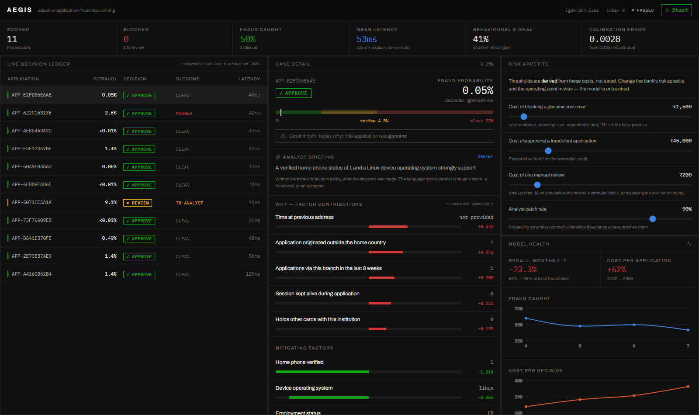
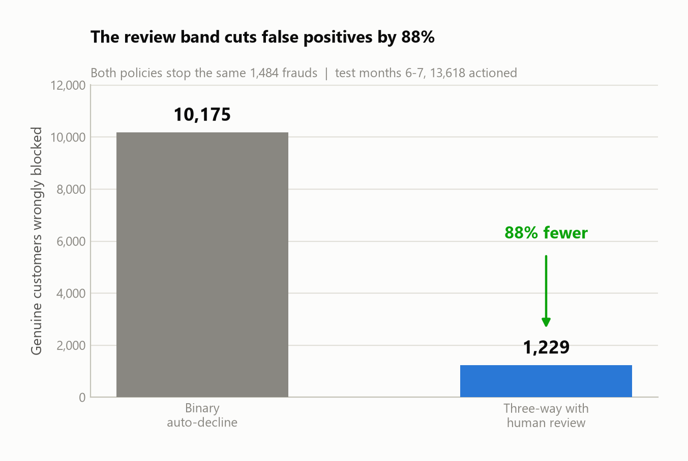
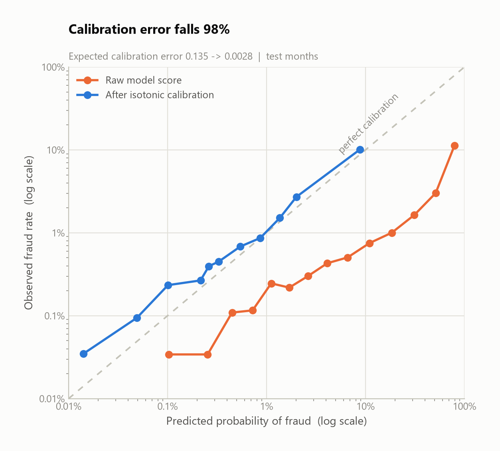
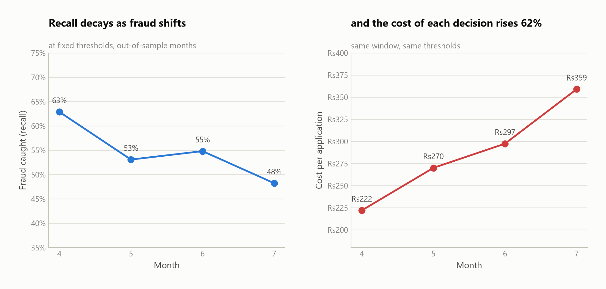
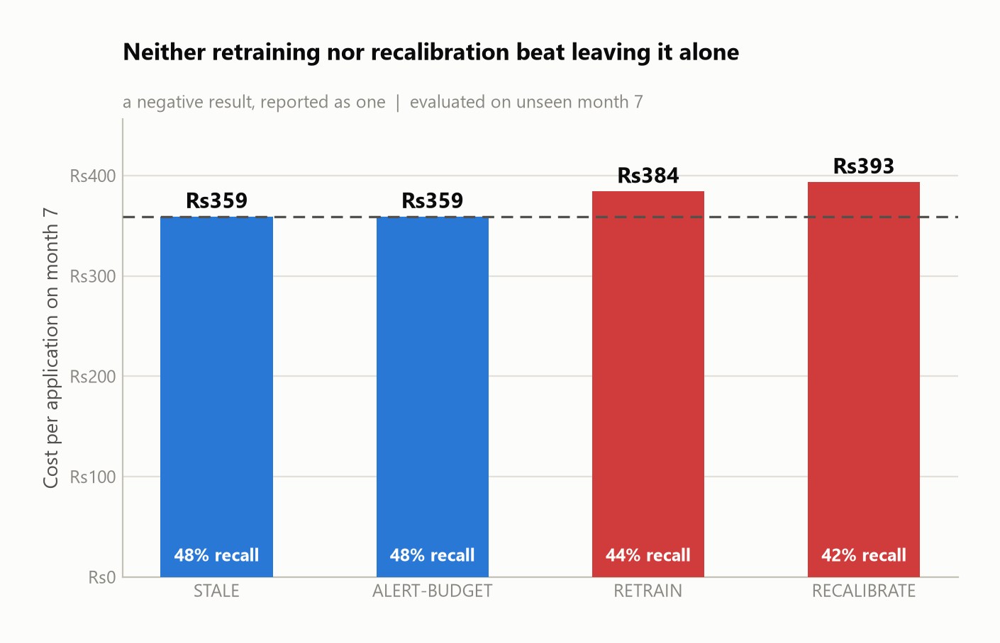
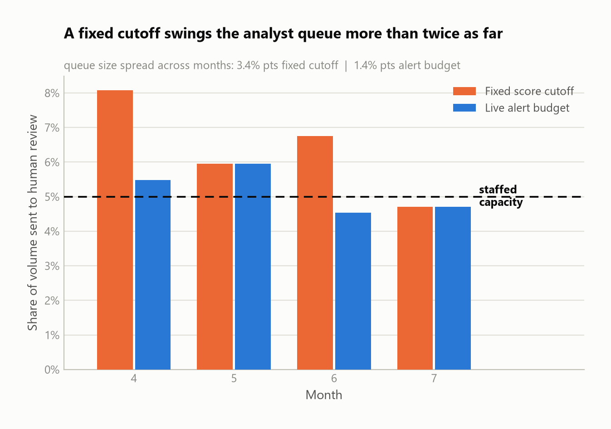

# Aegis — Adaptive Application-Fraud Decisioning for Digital Lending

Real-time fraud detection for digital lending origination, built for the Synchrony
technology hackathon (Problem Statement 1).

Aegis scores a loan application in **under 200ms**, explains every decision in reason
codes an analyst can act on and a regulator can audit, and derives its approve/review/block
boundaries from business economics rather than a tuned constant.



---

## The headline result

**At identical fraud detection, the three-way policy blocks 88% fewer genuine customers.**

| Policy, evaluated on held-out months 6–7 | Frauds stopped | Genuine customers blocked |
| --- | ---: | ---: |
| Binary auto-decline, tuned to equal recall | 1,484 | **10,175** |
| Three-way with a human review band | 1,484 | **1,229** |
| | — | **−87.9%** |



The mechanism is simple to state: instead of a single cut-off that auto-declines anything
suspicious, borderline applications route to an analyst who can clear good customers.
Reducing false positives is the brief's explicit ask, and this is it — measured against a
system that actually detects fraud, not against a strawman.

### Everything else, measured

| Metric | Value | Notes |
| --- | ---: | --- |
| ROC-AUC (held-out) | 0.880 | |
| PR-AUC | 0.168 | at 1.40% prevalence — **12× lift** over base rate |
| Recall @ 5% alert rate | 55.3% | the number a fraud ops manager acts on |
| **Calibration error (ECE)** | **0.135 → 0.0028** | **97.9% reduction** after isotonic calibration |
| Brier score | 0.0724 → 0.0126 | |
| Behavioural signal share | **41.3%** | of total model gain |
| Decision latency | p50 115ms / **p95 163ms** | round-trip, 40 requests |
| Tests | **69 passing** | |

**Accuracy is deliberately absent from this table.** At 1.1% fraud prevalence a model that
predicts "never fraud" scores 98.9%. Any submission leading with accuracy on this dataset is
reporting the base rate.

---

## Three findings worth your time

### 1. The thresholds are arithmetic, not folklore

Most fraud prototypes leave the decision threshold at 0.5, or tune it until F1 looks good.
Neither has a defensible justification. Aegis derives both boundaries from four business
costs by minimising expected cost:

```
tau_review = C_review / (catch_rate · C_fn)
tau_block  = (C_fp − C_review) / (C_fn · (1 − catch_rate) + C_fp)
```

Raise the cost of wrongly blocking a genuine customer and the system becomes measurably less
willing to block — **no retraining, because the model was never where the risk appetite
lived.** The console exposes this as a live control.

This only works if the probabilities mean what they say, which is why calibration is not
optional here:



The raw model predicts 80% where 11% is observed. Applying cost-derived thresholds to
uncalibrated scores would silently invalidate the entire decision layer — a mistake with a
permanent regression test guarding it
(`test_uncalibrated_scores_invalidate_the_cost_policy`).

### 2. Under drift, the model barely decays — the *policy* does



Across out-of-sample months 4→7, fraud prevalence rises 30%. ROC-AUC falls **2.1%**. But
recall at fixed thresholds falls **23.3%** and cost per application rises **62%**.

The reflexive answer to a decayed fraud model is "retrain it". The evidence says the model is
fine; the operating point drifted out from under it.

### 3. We tested three adaptation strategies. None beat doing nothing.



| Strategy on unseen month 7 | Cost/app | Recall |
| --- | ---: | ---: |
| **STALE** (do nothing) | **₹359** | **48.2%** |
| ALERT-BUDGET (label-free quantile) | ₹359 | 48.2% |
| RETRAIN (full refit) | ₹384 | 43.8% |
| RECALIBRATE (refit on recent labels) | ₹393 | 42.3% |

This is a negative result and it is reported as one. Both label-based strategies made things
*worse*. The diagnosis is mechanical: a fixed score cutoff fitted to one month's distribution
lands somewhere else on the next month's, so the review queue changes size for reasons
unrelated to fraud.

That points at a real design flaw in fixed cutoffs:



A fixed cutoff runs queues of 8.1% and 6.8% against a team staffed for 5%. Its apparently
better recall is **bought with analyst hours that do not exist** — and the cost model never
prices that backlog, which is a stated limitation below.

---

## Architecture

```
┌──────────────────────────────┐         ┌──────────────────────────────────────┐
│  React 19 + Vite + Tailwind  │  HTTPS  │  FastAPI  (Python 3.13)              │
│                              │────────►│                                      │
│  Live decision ledger        │         │  Decision engine                     │
│  Case detail + force bars    │         │   ├─ LightGBM         known fraud    │
│  Risk-appetite control       │         │   ├─ Isotonic calib.  honest P(fraud)│
│  Model health / drift        │         │   └─ pgvector k-NN    similar cases  │
└──────────────────────────────┘         │                                      │
                                         │  Policy layer                        │
                                         │   cost-derived thresholds →          │
                                         │   APPROVE / REVIEW / BLOCK           │
                                         │   capped by analyst capacity         │
                                         │                                      │
                                         │  Explainability                      │
                                         │   SHAP → reason codes → Gemini prose │
                                         │                                      │
                                         │  Drift monitor                       │
                                         └───────────────┬──────────────────────┘
                                                         │
                                         ┌───────────────▼──────────────────────┐
                                         │  Postgres + pgvector                 │
                                         │  applications · decisions            │
                                         │  fraud_vectors · audit_log           │
                                         └──────────────────────────────────────┘
```

### The LLM boundary

**Gemini explains decisions. It never makes them.**

The booster, the calibrator and the policy produce an outcome; SHAP explains that outcome;
Gemini turns the attributions into analyst prose. Nothing downstream of the policy can change
what was decided. Replaying the same application against the same model version yields an
identical decision whether or not the language model was reachable — verified by the smoke
test, not asserted.

Narration also sits **off the decision path**. It costs ~3.4s of provider latency, so the
stream never waits for it; the console requests prose only when an analyst opens a case. A
deterministic template always exists as a fallback, so every decision has an explanation even
when the provider is down or out of quota.

### Why a vector index

A supervised model only recognises fraud resembling its training labels. When an analyst
confirms a new fraud, its signature is indexed **immediately** and every subsequent lookalike
is flagged — with no retraining. One confirmed case becomes a detector.

Applications are compared by **the leaves they occupy in the gradient-boosted ensemble**, not
by raw feature distance. Two applications routed to the same leaves were routed there by the
same decisions, so similarity uses the model's own learned notion of alikeness and is directly
interpretable: "these agree in 82% of the model's decision paths."

---

## Quickstart

**Prerequisites:** Python 3.13 (not 3.14 — SHAP/LightGBM wheels lag), Node 20+, a Kaggle
account, and optionally a Gemini API key.

```bash
git clone https://github.com/Fearless2389/Fraud-Detection-for-online-Lending.git
cd Fraud-Detection-for-online-Lending
cp .env.example .env          # PowerShell: Copy-Item .env.example .env
```

Fill in `.env`. Generate an API key with:

```bash
python -c "import secrets; print(secrets.token_urlsafe(32))"
```

### 1. Backend

```bash
python -m venv .venv && .venv/Scripts/activate     # Windows
pip install -r backend/requirements.txt
python scripts/download_data.py                    # ~530 MB from Kaggle
```

> Kaggle credentials: kaggle.com → Settings → API → *Create New Token*, save `kaggle.json`
> to `~/.kaggle/`. Open the [dataset page](https://www.kaggle.com/datasets/sgpjesus/bank-account-fraud-dataset-neurips-2022)
> once and accept its terms, or the download fails silently.

```bash
cd backend
python ml/eda.py                 # schema, prevalence, drift, missingness
python ml/training/train.py      # ~2 min → model_bundle.joblib + metrics.json
python ml/training/analyse.py    # equal-recall comparison + drift
python ml/training/adapt.py      # the adaptation experiment
python ml/training/figures.py    # regenerates every figure in this README
uvicorn app.main:app --port 8000
```

### 2. Frontend

```bash
cd frontend
npm install
echo "VITE_API_KEY=<same key as backend .env>" > .env
npm run dev                      # http://localhost:5173
```

### 3. Verify

```bash
cd backend && python -m pytest   # 69 tests
python scripts/smoke_test.py     # end-to-end against the running API
```

---

## Project layout

```
backend/
  app/
    core/        config (12-factor), API-key auth
    schemas/     request/response contracts — the OpenAPI source of truth
    services/    policy · scoring · explain · similarity · demo_stream
    api/v1/      routes
  ml/
    eda.py               schema and drift exploration
    features/pipeline.py the single training↔serving feature contract
    training/            train · analyse · adapt · figures
  tests/         69 tests
frontend/src/
  components/    ledger · case detail · policy dial · drift panel
  lib/           typed API client, formatting
docs/
  specs/         design document
  figures/       every chart, regenerated from artifacts
scripts/         download_data.py · smoke_test.py
```

---

## Data

**Bank Account Fraud (BAF) suite** — Feedzai, NeurIPS 2022. Six datasets of ~1M rows,
generated from a real anonymised bank **account-opening** fraud problem via CTGAN with
differential privacy.

Chosen deliberately over the usual card-fraud datasets. Account-opening fraud is structurally
the same decision as lending origination — one application, assessed once, before any
relationship exists. Card-transaction fraud is a different problem wearing similar clothes,
and its PCA-anonymised features (`V1…V28`) make per-decision explanation impossible.

BAF also carries genuine temporal drift and protected attributes, which is what makes the
drift experiment and the fairness analysis measurements rather than assertions.

Three dataset-specific corrections are encoded in the feature pipeline, each derived from EDA
rather than assumed:

1. **Sentinel missing values.** BAF has no NaNs; "unavailable" is `-1`, and
   `prev_address_months_count` is 71% sentinel. Untreated, a tree learns rules about
   record-keeping rather than fraud.
2. **Impossible negatives from differential privacy.** DP noise pushes velocity counters
   below zero. Cleaned to missing, not clipped to zero — a noisy unknown is not a real zero.
3. **`intended_balcon_amount` is a hidden binary**, 74% negative across a continuous range.
   Split into a flag plus a cleaned amount.

> **Licence:** CC BY-NC-ND 4.0, academic/non-commercial. The CSVs are **not** committed;
> `scripts/download_data.py` fetches them.

---

## Engineering practices

**API-first.** FastAPI generates the OpenAPI document from the Pydantic schemas, so the
published contract cannot drift from the code serving it. Browse `/docs`.

**One feature pipeline.** `ml/features/pipeline.py` is imported by both the training scripts
and the API. Two implementations of the same feature logic is how training/serving skew gets
into production, and it is invisible until scores are already wrong.

**Testing (69).** Not vanity coverage — the suite guards specific, known failure modes:

- `test_single_row_scoring_matches_batch` — pandas categoricals are identified by integer
  code, so building a category from a one-row request assigns codes from that row alone and
  the model reads a *different category than the caller sent*. No error, no crash, every
  prediction quietly wrong. This test caught it during development.
- `test_uncalibrated_scores_invalidate_the_cost_policy` — asserts a *failure* deliberately.
  If it ever passes, the calibration step has stopped being load-bearing.
- `test_raising_false_positive_cost_raises_block_threshold` — the project's economic claim,
  as an assertion.
- `test_service_starts_without_artifacts_and_says_so` — missing model degrades to an
  actionable 503, never a crash-loop.

**Reproducibility.** Every number in this README regenerates from `backend/ml/training/`.
Fixed seeds throughout; figures are drawn from saved artifacts, never by hand.

---

## Security

| Control | Implementation |
| --- | --- |
| Authentication | API key on every `/api/v1` route, compared in constant time (`secrets.compare_digest`) |
| Input validation | Pydantic bounds every field; unknown fields rejected (`extra="forbid"`) |
| Rate limiting | slowapi — unlimited scoring queries let an attacker map the decision boundary |
| Secrets | Read from environment only; `.env` gitignored; `.env.example` committed |
| CORS | Explicit origins from config, never a wildcard |
| SQL | Parameterised throughout |
| Production hardening | `/docs` and `/openapi.json` disabled when `APP_ENV=production` |
| Audit | Every decision carries model version, thresholds and score — reconstructable from the response alone |

**Known weakness, stated rather than hidden:** the prototype console holds the API key in the
browser. That is acceptable for a single-operator demo and **not** how this should be
deployed — a shared secret shipped to a browser is readable by anyone with devtools. The
production path is a session-authenticated backend-for-frontend holding the key server-side.

---

## Responsible AI

**Explainability by construction.** Every decision carries SHAP attributions, not just
declines. Adverse-action reasons are ordered by actual contribution, which is what makes them
*principal* reasons in the sense fair-lending rules require, rather than a generic list.

**The fairness tension is real and is reported, not resolved quietly.** `customer_age` is
simultaneously one of the strongest predictors in the data (fraud rate rises from 0.35% in the
youngest band to 5.26% in the oldest) and a protected characteristic. BAF ships protected
attributes precisely so this can be measured.

**The LLM cannot influence an outcome.** See the architecture note above.

**Demo data is disclosed.** The console replays genuine held-out applications with fraud
over-sampled to 20% and spaced deterministically, so a short demo reliably shows both
outcomes. The true prevalence (1.40%) is returned with every stream response and displayed
on screen. The ledger shows **misses**, not just catches.

---

## Limitations

Stated openly rather than left for a reviewer to find.

- **The cost model does not price capacity overflow.** It charges ₹200 per review whether or
  not an analyst exists to do it. This is precisely why the fixed cutoff appears to beat the
  alert budget on recall — it is spending hours it does not have.
- **BAF is a privacy-preserving synthetic rendering** of a real dataset. It preserves
  realistic structure but is not live production data.
- **Account-opening fraud is a close analogue of lending-origination fraud, not an identical
  problem.** Feature availability would differ in a real deployment.
- **No adaptation strategy tested beat doing nothing.** Reported as the negative result it is.
- **Isotonic calibration produces heavily tied probabilities**, so quantile- and
  capacity-based thresholds are coarse — neither mechanism hits exactly 5%. Exact capacity
  targeting would need tie-breaking on the raw score.
- **The prototype runs locally.** Cloud architecture is designed and documented but only
  partially exercised.
- **The analyst catch rate (90%) is an assumption**, not a measurement. It is configuration,
  so it can be replaced with an observed figure.

---

## Problem statement mapping

| The brief asks for | Where it is |
| --- | --- |
| Real-time detection | Synchronous scoring, p95 163ms, no batch path exists |
| Machine learning **and behavioural analytics** | Velocity, device, session features — 41.3% of model gain |
| Reducing false positives | 88% fewer at equal recall, via the cost-derived review band |
| Adapting to new fraud vectors | Similarity index (instant, no retrain) + a measured drift study |
| React frontend | React 19 + Vite + Tailwind v4 |
| Spring Boot *or equivalent* | FastAPI — chosen for native ML integration |
| PostgreSQL + pgvector | `app/services/similarity.py` — see the note below |
| LLM service | Gemini, strictly downstream of decisioning |
| Security, no hardcoded secrets | See the security table |
| Unit testing | 69 tests |
| Explainability & responsible AI | SHAP reason codes, adverse-action ordering, fairness analysis |

> **pgvector honesty note:** the similarity layer has two interchangeable backends. The
> in-memory index is what the running prototype uses. The `PgVectorSimilarityIndex`
> implementation is complete — schema, HNSW index, cosine search, Johnson-Lindenstrauss
> projection of leaf assignments — but has **not been executed against a live Postgres**. It
> is code, not a demonstrated result, and is described as such.

---

## Licence & attribution

Built for the Synchrony technology hackathon, August 2026.
Dataset: [Bank Account Fraud Suite (NeurIPS 2022)](https://www.kaggle.com/datasets/sgpjesus/bank-account-fraud-dataset-neurips-2022),
Feedzai, CC BY-NC-ND 4.0.
